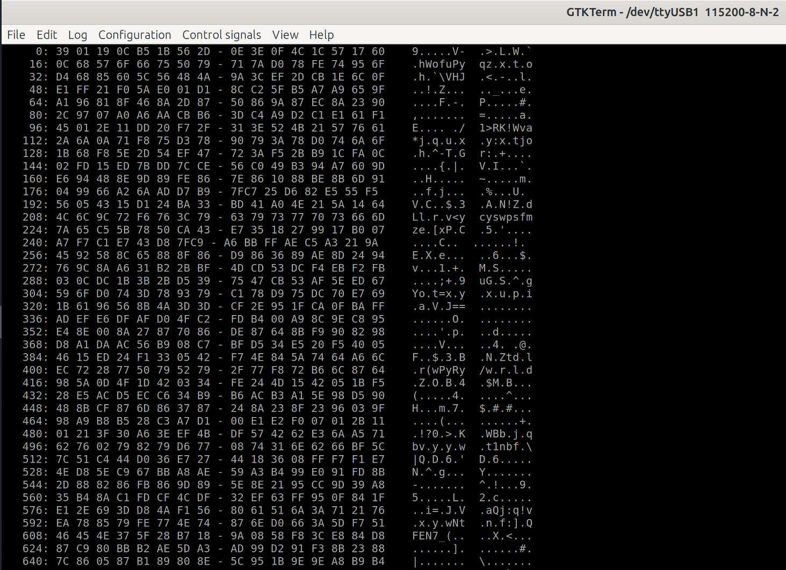
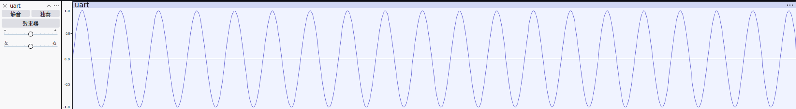

# Sinc Resampler (Chisel)

This project implements a hardware [Sinc Resampler](https://ccrma.stanford.edu/~jos/smith-nam/Windowed_Sinc_Interpolation.html) using [Chisel](https://www.chisel-lang.org/).

### Command Line Arguments

| Argument | Description | Default |
| :--- | :--- | :--- |
| `--freq-x` | Input sample rate (Hz) | 16000 |
| `--freq-y` | Output sample rate (Hz) | 48000 |
| `--channels` | Number of channels (1 or 2) | 1 |
| `--pll-type` | PLL type: `arty-a7-100t` or `bypass` | `arty-a7-100t` |
| `--audio-file-resource` | Audio file in resources to use for initialization | `AudioPCM16KHz1ChSweep.mem` |

### Example

To generate the Verilog for converting 16kHz to 48kHz, 1 channel, targeting the Arty A7-100T:

```bash
sbt "run --freq-x 16000 --freq-y 48000 --channels 1 --pll-type arty-a7-100t"
```

### Simulation on Arty-A7-A100T

#### UART Output

The following image shows the UART output when simulating on FPGA:



#### Raw Audio in Audacity

The raw audio imported into Audacity at 48000 Hz sample rate:



